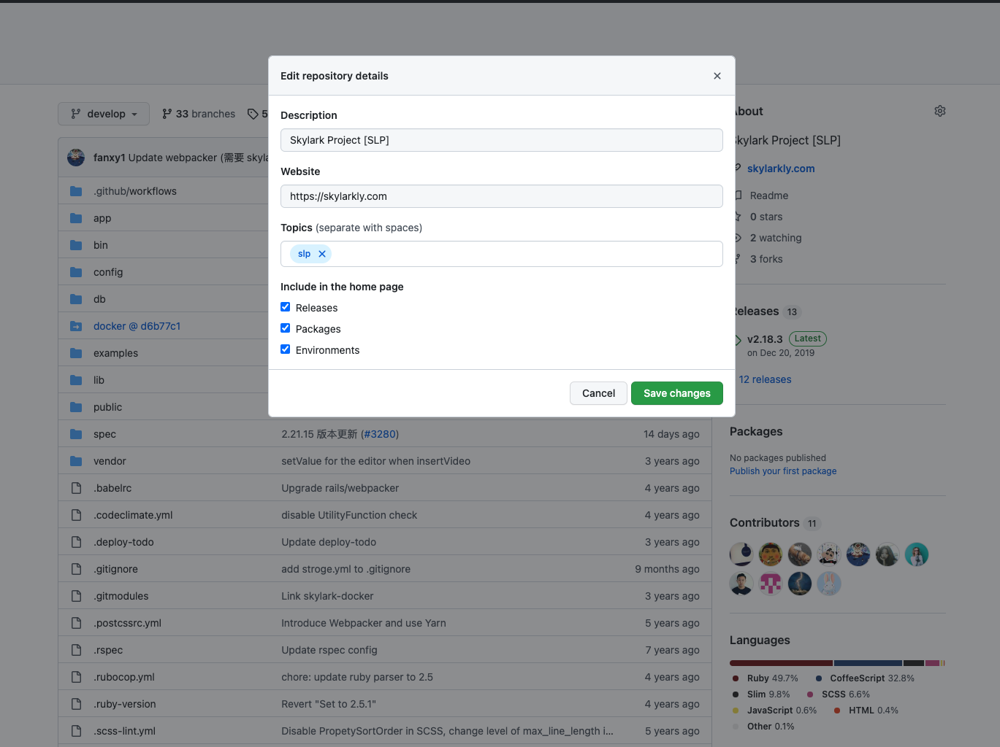
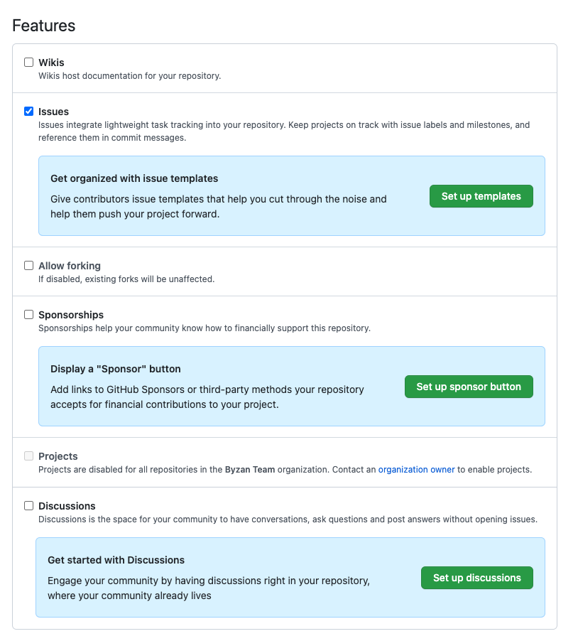
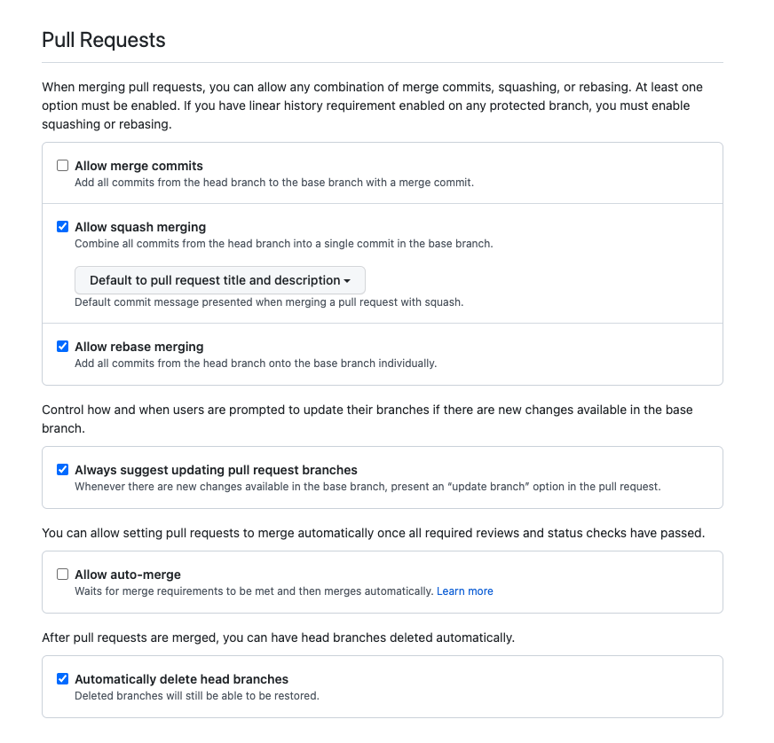
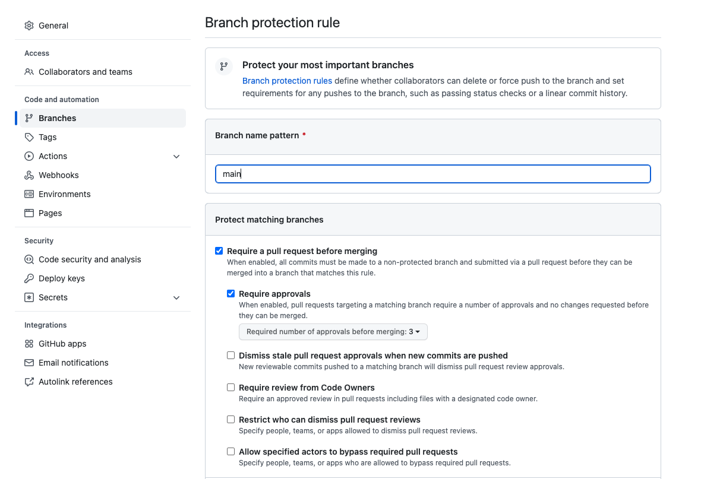

# Manage Repository

> Skylark 团队项目仓库的管理

#### 分支
- 项目的 *开发分支* 是 `develop`，默认分支也是 `develop` ✅
- *生产分支* 为 `main`（部署到线上的版本） ✅
- 代码只有经过 **review** 后才可以合并到 `develop` 和 `main` 分支

#### 基础设置
- Repository
  - 仓库名称 ✅
  - 简单的仓库描述 ✅
  - 

      
打上对应的 <code>topic</code> 如：<code>slp</code>（<b>必填</b>）, <code>slp-frontend</code> 等 ✅

      <ul>
        <li><code>slp</code> 是 Skylark 团队相关项目必填 </li>
      </ul>
      
    

- README.md
  - 相关文档
  - 客户信息（如果没有可忽略）

#### 权限
##### 给对应团队的权限 ✅
 - `admin`: slp-admin（固定）
 - `write`: 当前仓库的开发者所在的团队或个人（如：slp-frontend）
 - `read`: slp-test
 - [团队信息参考](https://github.com/orgs/Byzanteam/teams)
 - 

    
示例

    
   

##### 需要修改的仓库配置 ✅
 - General
   - Features
     - 

        
只保留 <code>issues</code>

        
       

   - Pull Requests
     - 取消 `Allow merge commits`
       - [PR 合并建议使用 squash merge](https://github.com/conventional-changelog/standard-version#should-i-always-squash-commits-when-merging-prs)
     - 取消 `Allow auto-merge`
     - 

         
<code>Pull Requests</code> 示例

         
       

##### Branches ✅
  - 分支 `main` / `develop` 的 `Require approvals` 设置成 3
    - 至少需要三个 `approved` 才能 merge（特殊情况 @slp-admin）
    - 

         
<code>Branches</code> 示例

         
      

