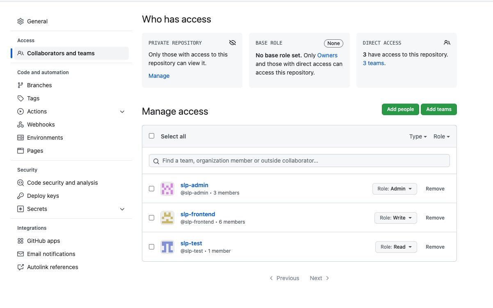

# Manage Repository

> Skylark 团队项目仓库的管理

1. 主分支是 develop，线上分支为 main（生产环境）
   - 不允许直接 push 到 develop 和 main 分支
2. 创建仓库，并设置对应的权限
   - 仓库名称
   - 简单的仓库描述
   - 相关文档
   - 客户信息（如果没有可忽略）
   - 打上对应的标签如：slp, slp-frontend 等
3. 修改仓库的配置信息
   - 给对应团队的权限
     - admin: slp-admin（固定）
     - write: 当前仓库的开发者所在的团队（如：slp-frontend）
     - read: slp-test
     
   - [团队信息参考](https://github.com/orgs/Byzanteam/teams)
   - 需要修改的仓库配置
     - General
       - Features 
         - 中只保留 issues
           
       - Pull Requests 
         - 取消 Allow merge commits
         - 取消 Allow auto-merge
           
     - Branches
       - main/develop Require approvals 设置成 3
         
   - 移交权限给 [fanxy1](https://github.com/fanxy1)
4. [只允许 squash merge](https://github.com/conventional-changelog/standard-version#should-i-always-squash-commits-when-merging-prs)
5. 至少需要三个 approved 才能 merge（特殊情况 @slp-admin）
